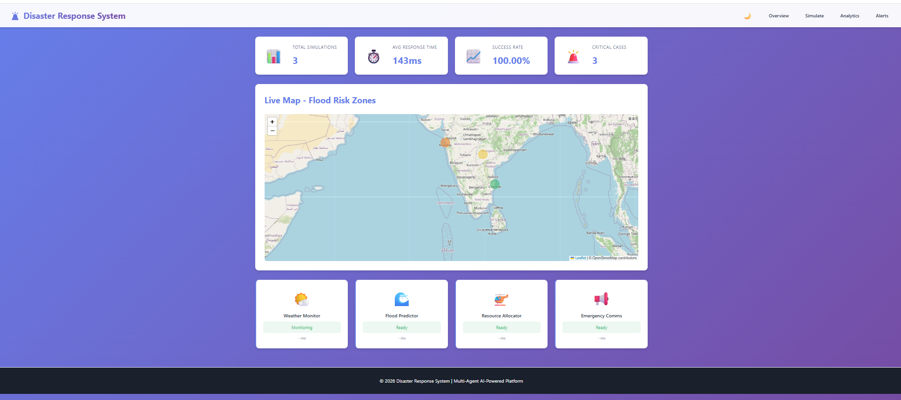
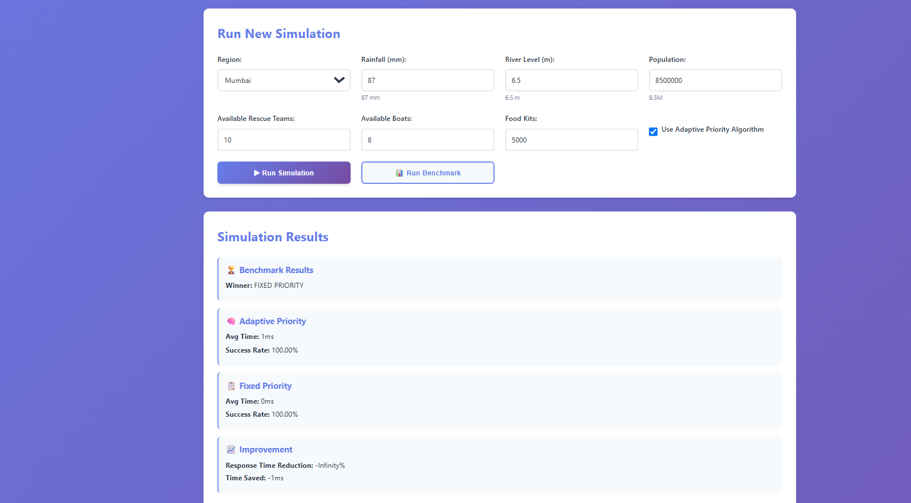
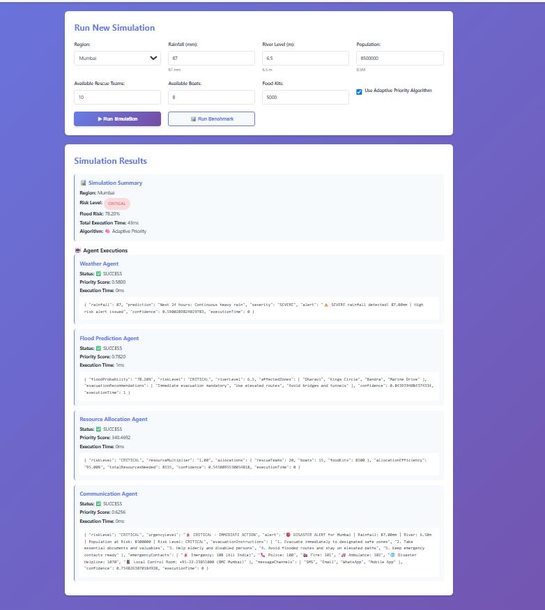
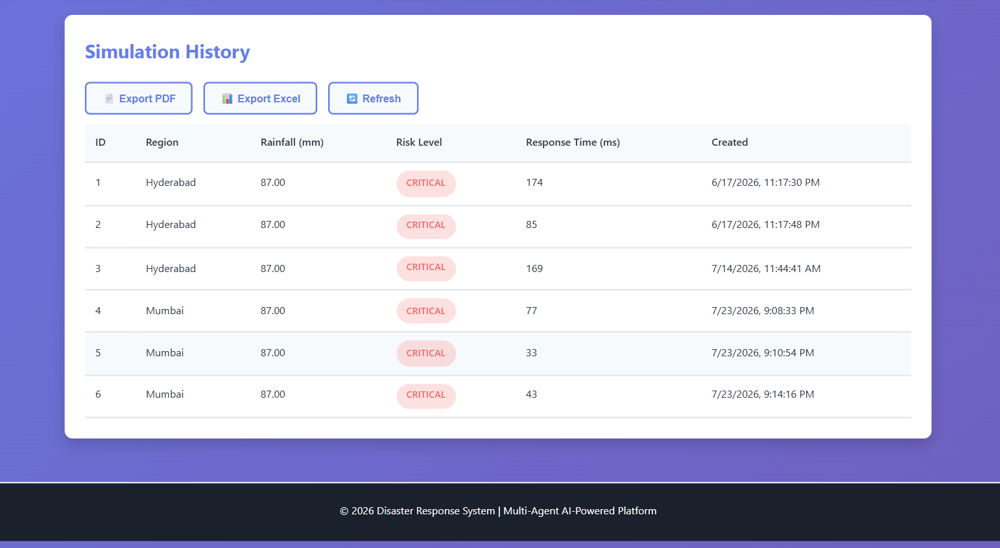

# Disaster Response System

> A **Multi-Agent Disaster Management Platform** built with **Spring Boot** that simulates disaster conditions, predicts flood risk, allocates emergency resources, generates alerts, and provides real-time monitoring through a WebSocket-enabled dashboard.

---

# Overview

The Disaster Response System uses multiple intelligent agents coordinated by a Supervisor Agent to analyze disaster conditions and execute emergency response tasks. An Adaptive Priority Engine dynamically determines the execution order of agents to improve response efficiency.

---

# Key Features

- Multi-Agent Disaster Response Workflow
- Weather Condition Analysis
- Flood Risk Prediction
- Emergency Resource Allocation
- Disaster Alert Generation
- Adaptive Priority Engine
- Real-Time Dashboard using WebSocket
- Simulation History Management
- Agent Performance Tracking
- Adaptive vs Fixed Priority Benchmarking
- PDF Report Generation
- Excel Report Export

---

# Multi-Agent Architecture

| Agent | Responsibility |
|-------|----------------|
| **Supervisor Agent** | Coordinates all agents and manages simulation execution. |
| **Weather Agent** | Analyzes rainfall, river level, and weather conditions. |
| **Flood Prediction Agent** | Calculates flood risk and determines risk levels. |
| **Resource Allocation Agent** | Allocates emergency teams, boats, and food kits. |
| **Communication Agent** | Generates disaster alerts and response messages. |
| **Adaptive Priority Engine** | Dynamically prioritizes agent execution based on disaster severity. |

---

# Screenshots

## Dashboard



---

## Disaster Simulation



---

## Simulation Results



---

## Reports



---

# Tech Stack

| Category | Technologies |
|-----------|--------------|
| **Backend** | Java 17, Spring Boot, Spring Framework, Spring Data JPA, Hibernate, REST APIs, WebSocket, Maven, Lombok |
| **Frontend** | HTML5, CSS3, JavaScript, Thymeleaf |
| **Database** | MySQL |
| **Reporting** | Apache POI, Apache PDFBox |
| **Development Tools** | Git, GitHub, IntelliJ IDEA, VS Code, Eclipse, Postman |

---

# Project Structure

```text
disaster-response-system/
├── src/
├── screenshots/
├── pom.xml
├── README.md
└── schema.sql
```

---

# Prerequisites

- Java 17+
- Maven 3.6+
- MySQL 8+
- Git

---

# Database Setup

```sql
CREATE DATABASE disaster_db;
```

Import the provided **schema.sql** file before running the application.

---

# Configuration

Update the database configuration in:

```text
src/main/resources/application.yml
```

```yaml
spring:
  datasource:
    url: ${DB_URL:jdbc:mysql://localhost:3306/disaster_db}
    username: ${DB_USERNAME:root}
    password: ${DB_PASSWORD}
```

---

# Run the Application

### Clone Repository

```bash
git clone https://github.com/Md-Minshaniya/disaster-response-system.git
```

### Build Project

```bash
mvn clean install
```

### Run Project

```bash
mvn spring-boot:run
```

Open the application:

```text
http://localhost:8080
```

---

# Application Workflow

```text
User Input
      │
      ▼
Supervisor Agent
      │
      ▼
Adaptive Priority Engine
      │
      ▼
Weather Agent
      │
      ▼
Flood Prediction Agent
      │
      ▼
Resource Allocation Agent
      │
      ▼
Communication Agent
      │
      ▼
Database + Dashboard + Reports
```

---

# Main Modules

## Simulation Management

The simulation accepts:

- Region
- Rainfall
- River Level
- Population
- Available Emergency Teams
- Available Boats
- Available Food Kits

The collected inputs are processed by the agents and the simulation results are stored in MySQL.

---

## Real-Time Monitoring

- Live WebSocket updates
- Agent execution status
- Risk level monitoring
- Execution time tracking
- Dashboard statistics

---

## Benchmarking

- Adaptive Priority Execution
- Fixed Priority Execution
- Performance Comparison

---

## Reporting

- PDF Report Generation
- Excel Report Export
- Simulation History Export

---

# Database Entities

## Simulation

Stores:

- Region
- Rainfall
- River Level
- Population
- Flood Risk
- Risk Level
- Response Time
- Priority Mode
- Creation Time

## Agent Execution

Stores:

- Simulation Reference
- Agent Name
- Execution Time
- Priority Score
- Agent Result
- Creation Time

---

# Testing

The REST APIs can be tested using **Postman**.

Verify the project using:

```bash
mvn clean install
```

Confirm that:

- Application starts successfully.
- MySQL connection is established.
- Dashboard loads correctly.
- Disaster simulations execute successfully.
- Simulation history is stored.
- WebSocket updates are displayed.
- PDF reports are generated.
- Excel reports are generated.
- Benchmarking completes successfully.
